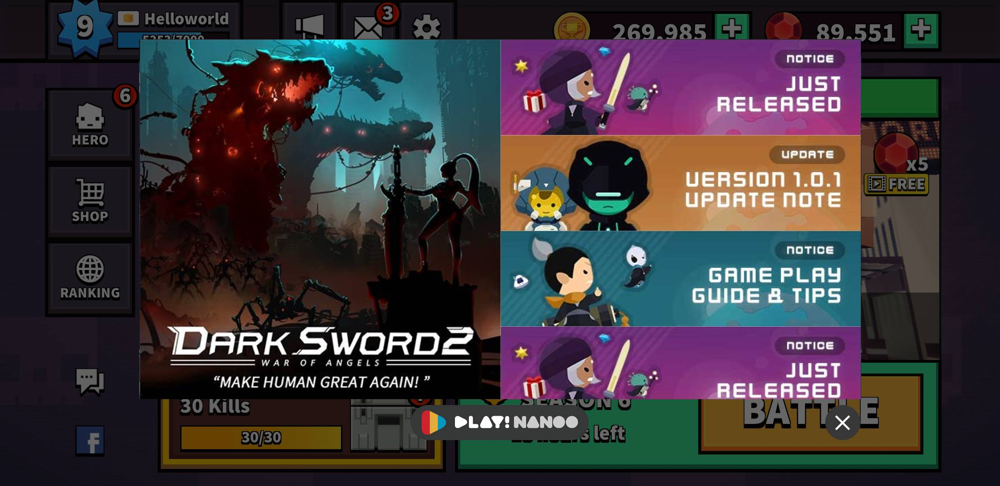

# PlayNANOO UnityPlugin
_Copyright (c) 2019 NANOO Company Inc. All rights reserved._

PlayNANOO Plugin for Unity has server-side features that are available to game developers for free without needing to deploy a server.

## Version
PlayNANOO Plugin Version 2.0.0

## Update History

* Version 2.0.0
    * ARM64 Support
    * iOS Build Bugfix

* Version 1.0.0
    * First Release

## Overview

Use PlayNANOO Plugin to implement a variety of functions required for server connection.
The following features are provided by the Plugin.

* In-Game Forum 
* In-Game Help Desk
* Coupons
* Inbox 
* In-App Purchase Validation 
* Game Data Storage 
* Real-time Ranking 
* And more

__NOTICE__: The Plugin does not support Unity version 5.3.x and below, and iOS version 8.x and below.

System requirements:

* Unity&reg; 5.4 or above.

* Android:
    * Android SDK
    * Android v4.4 or higher

* iOS
	* iOS v9.0 or higher

## Congifure Your Game

To use the Plugin, create a game first on [PlayNANOO Console](https://console.playnanoo.com).

Enable features needed for the game for integration.

### API Key Query 

Looks up API Key information in [PlayNANOO Console](https://console.playnanoo.com) settings.

### Unity Information Settings

Import PlayNANOOUnityPlugin.unitypackage, then select PlayNANOO project menu and enter API Key information.


* **Game ID** - ID created on PlayNANOO Console
* **Service Key** - Key used for PlayNANOO API communication 
* **Secret Key** - Key used for PlayNANOO API communication

## Android Build Settings

### Permission Settings

The following permissions are required for Android builds.

* **INTERNET** - Permission for using In-Game Forums and User Support.
* **WRITE_EXTERNAL_STORAGE** - Permission for adding user image files.

```csharp
<manifest>
...
<uses-permission android:name="android.permission.INTERNET" />
<uses-permission android:name="android.permission.WRITE_EXTERNAL_STORAGE" />
...
</manifest>
```

### Add Activity

Activity information is required to add user images.

```csharp
<activity android:name="com.playnanoo.unity.plugin.PlayNANOOFileChooserActivity" android:theme="@android:style/Theme.Translucent.NoTitleBar.Fullscreen" />
```

## iOS Build Setting

### Add Permissions for Camera and Photo Library 

Adds permissions for camera and photo library to enable attaching files in Forums and Help Desk.

* Privacy - Camera Usage Description
* Privacy - Photo Library Usage Description

### Add Framework

Adds AdSupport.framework and WebKit.framework.

## Embedded Binaries Settings

Adds PlayNANOO.framework to Embedded Binaries for PlayNANOO services.

1. Remove PlayNANOO.framework from 'Linked Frameworks and Libraries'.
2. Add PlayNANOO.framework to 'Embedded Binaries'.


## Basic Settings 

Looks up user information and a variety of default values of PlayNANOO  

**Example**
```csharp
plugin.SetInfo("User Unique ID", "Nickname", "Language Code");
plugin.Init();
```	
* Unique User's ID - User's shared ID used in the app.
* Nickname - Username (Acquired from app stores, such as Google Play Games and Apple Game Center)
* Language Code - Language code (e.g. en_US for US English, ja_JP for Japanese, es_ES for Spanish, etc.)

**Result**
```csharp
HTTP/1.1 200 OK
Content-Type: application/json;charset=UTF-8
{
    "code" : 200,
    "message" : 0,
    "value" : {
        "postbox_count" : 0,
        "postbox_subscription" : [
            {
                "product" : "Product Title",
                "ttl" : 0, 
            }
        ]
    }
}
```	

**Description**
* postbox_count - Item quantity in the inbox
* postbox_subscription - Inbox subscription item information
    * product - Item name
    * ttl - Reamining time for subscrition (Unit in seconds)

## In-Game Forum 

Provides forum community within the game.

### Run Forum

Runs the main forum.

**Example**
```csharp
plugin.SetInfo("User Unique ID", "Nickname", "Language Code");
plugin.OpenForum();
```	


### Run Forum Link

Runs a specified forum page.

**Example**
```csharp
	plugin.SetInfo("User Unique ID", "Nickname", "Language Code");
	plugin.OpenForumView(URL);
```	


### Run Forum Event Banner

Runs event banner configured on the Console.

**Example**
```csharp
	plugin.SetInfo("User Unique ID", "Nickname", "Language Code");
	plugin.OpenHome();
```	



### Forum Data Query 

Looks up data added by the user in the forum.

**Example**
```csharp
plugin.SetInfo("User Unique ID", "Nickname", "Language Code");
plugin.ForumThread("Language Code", "Type", "Limit", (result) => { Debug.Log(result); });
```	

**Result**
```csharp
HTTP/1.1 200 OK
Content-Type: application/json;charset=UTF-8
{
    "code" : 200,
    "message" : 0,
    "value" : [
        {
            "seq" : 1, 
            "title" : "TEXT", 
            "content" : "TEXT", 
            "attach_file" : [],
            "url" : "https://~~",
            "post_date" : 1548839719
        }
    ]
}
```

## In-Game Help Desk 

Initiates a user help desk window.

**Example**
```csharp
plugin.SetInfo("User Unique ID", "Nickname", "Language Code");

// User Support inquiry category information customization
// Customized information is entered automatically when user support service is run.
// e.g. Server Information, Email Information, Game Info, etc.
plugin.SetHelpOptional("Added Category Key", "Added Category Value");

// Run User Support 
plugin.OpenHelp();
```	


## Coupons

Looks up event coupons.

**Example**
```csharp
plugin.SetInfo("User Unique ID", "Nickname", "Language Code");
plugin.Coupon("Coupon Code", (result) => { Debug.Log(result); });
```	

**Result**
```csharp
    HTTP/1.1 200 OK
    Content-Type: application/json;charset=UTF-8
    {
        "code" : 200,
        "message" : 0,
        "value" : {
            "uuid" : "TEXT", 
            "item_code" : "TEXT", 
            "item_count" : 0,
            "hash" : "TEXT"
        }
    }
```

**Description**
* uuid - Unique user ID
* item_code - Item code
* item_count - Item quantity 
* hash - HASH information

## Postbox 

### Item Query

Looks up items in user's inbox.

**Example**
```csharp
plugin.SetInfo("User Unique ID", "Nickname", "Language Code");
plugin.PostboxItem((result) => { Debug.Log(result); });
```	

**Result**
```json
HTTP/1.1 200 OK
Content-Type: application/json;charset=UTF-8
{
    "code" : 200,
    "message" : 0,
    "value" : [
        {
            "uid" : "TEXT", 
            "message" : "TEXT",
            "item_code" : "TEXT",
            "item_count" : 0,
            "expire_sec" : 0 
        }
    ]
}
```

**Description**
* uuid - Unique user ID
* message - Message to shown in the inbox
* item_code - Item code
* item_count - Item quantity 
* expire_sec - Expiration time for item in inbox

### Issue Item

Issue item to user's inbox.

**Example**
```csharp
plugin.SetInfo("User Unique ID", "Nickname", "Language Code");
plugin.PostboxItemSend("Item Product Code", "Item Product Quantity", "Item expiration period(days)", "Message to the recipient", (result) => { Debug.Log(result); });
```	

**Result**
```json
HTTP/1.1 200 OK
Content-Type: application/json;charset=UTF-8
{
    "code" : 200,
    "message" : 0,
    "value" : [] 
}
```

### Issue an Item to a Target User

Issue items to a specific user's inbox.

**Recommendation**
Use this feature to send a certain item to a friend.

**Example**
```csharp
plugin.SetInfo("User Unique ID", "Nickname", "Language Code");
plugin.PostboxFriendItemSend("Friend Unique ID", "Item Product Code", "Item Product Quantity", "Item expiration period (days)", "Message for the recipient", (result) => { Debug.Log(result); });
```	

**Result**
```json
HTTP/1.1 200 OK
Content-Type: application/json;charset=UTF-8
{
    "code" : 200,
    "message" : 0,
    "value" : [] 
}
```

### Use Item

Use user's item stored in inbox.

**Example**
```csharp
plugin.SetInfo("User Unique ID", "Nickname", "Language Code");
plugin.PostboxItemUse("Item unique code registered in Inbox", (result) => { Debug.Log(result); });
```	

**Result**
```json
HTTP/1.1 200 OK
Content-Type: application/json;charset=UTF-8
{
    "code" : 200,
    "message" : 0,
    "value" : {
        "uuid" : "TEXT",
        "item_code" : "TEXT", 
        "item_count" : 0, 
        "hash" : "TEXT"
    }
}
```

**Description**
* uuid - User Unique ID
* item_code - Item Code
* item_count - Item quantity
* hash - HASH infomration

### Add Subscription Item

**What is a Subscription Item**
It is an in-game product that a user can purchase to receive certain items once a day for a specified period of time.

**Example**
```csharp
plugin.SetInfo("User Unique ID", "Nickname", "Language Code");
plugin.PostboxSubscriptionRegister("Subscription Product Unique Code", (result) => { Debug.Log(result); }); 
```	

**Result**
```json
HTTP/1.1 200 OK
Content-Type: application/json;charset=UTF-8
{
    "code" : 200,
    "message" : 0,
    "value" : []
}
```

### Subscription Cancellation

Cancels user's subscription information.

**Example**
```csharp
plugin.SetInfo("User Unique ID", "Nickname", "Language Code");
plugin.PostboxSubscriptionCancel("Subscription Product Unique Code", (result) => { Debug.Log(result); }); 
```	

**Result**
```json
HTTP/1.1 200 OK
Content-Type: application/json;charset=UTF-8
{
    "code" : 200,
    "message" : 0,
    "value" : [] 
}
```	

### Reset 

Deletes all items in the inbox.

**Example**
```csharp
plugin.SetInfo("User Unique ID", "Nickname", "Language Code");
plugin.PostboxClear((result) => { Debug.Log(result); });
```	

**Result**
```json
HTTP/1.1 200 OK
Content-Type: application/json;charset=UTF-8
{
    "code" : 200,
    "message" : 0,
    "value" : [] 
}
```	

## In-App Purchase Validation 

Upon an in-app item purchase, it verifies receipts to prevent issuing of items fraudulently.

### Android Receipt Verification 

**Example**
```csharp
plugin.SetInfo("User Unique ID", "Nickname", "Language Code");
plugin.ReceiptVerificationAOS("Paid Product ID", "Receipt Information", "Signature Information", "Current Code", "Pay Amount", (result) => { Debug.Log(result); }); 
```	

**Result**
```json
HTTP/1.1 200 OK
Content-Type: application/json;charset=UTF-8
{
    "code" : 200,
    "message" : 0,
    "value" : {
        "uuid" : "TEXT", 
        "package" : "TEXT", 
        "product_id" : "TEXT", 
        "order_id" : "TEXT",
        "hash" : "TEXT"
    }
}
```	

### iOS Receipt Verification

**Example**
```csharp
	plugin.SetInfo("User Unique ID", "Nickname", "Language Code");
	plugin.ReceiptVerificationIOS("Paid Product ID", "Receipt Information", "Currency Code", "Pay Amount", (result) => { Debug.Log(result); }); 
```	

**Result**
```json
HTTP/1.1 200 OK
Content-Type: application/json;charset=UTF-8
{
    "code" : 200,
    "message" : 0,
    "value" : {
        "uuid" : "TEXT", 
        "package" : "TEXT", 
        "product_id" : "TEXT",
        "order_id" : "TEXT", 
        "hash" : "TEXT"
    }
}
```	

## Game Data Storage

Saves user's game data to prevent unwanted data reset.

### Data Storage 

* 64KB is the maximum data size for data saves.

**Example**
```csharp
	plugin.SetInfo("User Unique ID", "Nickname", "Language Code");
	plugin.StorageSave("Save Key", "Save Information", (result) => { Debug.Log(result); }); 
```	

**Result**
```json
HTTP/1.1 200 OK
Content-Type: application/json;charset=UTF-8
{
    "code" : 200,
    "message" : 0,
    "value" : [] 
}
```	

### Data Call

**Example**
```csharp
plugin.SetInfo("User Unique ID", "Nickname", "Language Code");
plugin.StorageLoad("Save Key", (result) => { Debug.Log(result); });  
```	

**Result**
```json
HTTP/1.1 200 OK
Content-Type: application/json;charset=UTF-8
{
    "code" : 200,
    "message" : 0,
    "value" : {
        "uuid" : "TEXT", 
        "nickname" : "TEXT",
        "value" : "TEXT",
        "hash" : "TEXT"
    }
}
```	

**Description**
* uuid - User's unique ID
* nickname - Nickname
* value - Saved data value
* hash - HASH information

## Real-time Ranking 

Provides player rankings to the user in real-time. 
It also updates user play information on the ranking in real-time.

### Ranking Query 

Rankings can be queried by Basic Ranking, Season Ranking, or Ranking by Country.

**Example**
```csharp
plugin.SetInfo("User Unique ID", "Nickname", "Language Code");

// Normal Ranking Inquiry
plugin.Ranking("Ranking Unique Code", "Number of queries (50 max.)", (result) => { Debug.Log(result); }); 

// Season Ranking Inquiry
plugin.Ranking("Ranking Unique Code", "Season Number", "Number of queries (50 max.)", (result) => { Debug.Log(result); }); 

// Country Season Ranking Inquiry
plugin.Ranking("Ranking Unique Code", "Season Number", "Country Code", "Number of queries (50 max.)", (result) => { Debug.Log(result); }); 
```	

**Result**
```json
HTTP/1.1 200 OK
Content-Type: application/json;charset=UTF-8
{
    "code" : 200,
    "message" : 0,
    "value" : [
        {
            "uuid" : "TEXT", 
            "nickname" : "TEXT", 
            "country" : "TEXT",
            "score" : 0, 
            "data" : "TEXT" 
        }
    ]
}
```	

**Description**
* uuid - User's unique ID
* nickname - Nickname
* country - Country code 
* score - Game score
* data - Player data 

### Ranking Record

Records user's play score and updates to the ranking in real-time.

* Up to 4KB of additional player data can be added.
* Supports ISO 3166-2 alpha-2 country code format.

**Example**
```csharp
plugin.SetInfo("User Unique ID", "Nickname", "Language Code");
plugin.RankingRecord("Ranking Unique Code", "Country Code", "Acquired Score", "Additional Data", (result) => { Debug.Log(result); }); 
```	

**Result**
```json
HTTP/1.1 200 OK
Content-Type: application/json;charset=UTF-8
{
    "code" : 200,
    "message" : 0,
    "value" : [] 
}
```	

### Personal Ranking Query

Looks up user's personal ranking information.

**Example**
```csharp
	plugin.SetInfo("User Unique ID", "Nickname", "Language Code");
	plugin.RankingMy("Ranking Unique Code", (result) => { Debug.Log(result); }); 
```	

**Result**
```json
HTTP/1.1 200 OK
Content-Type: application/json;charset=UTF-8
{
    "code" : 200,
    "message" : 0,
    "value" : {
        "ranking" : -1,  
        "nickname" : "TEXT",
        "country" : "TEXT", 
        "player_data" : "TEXT", 
        "total_player" : 0
    }
}
```	

**Description**
* ranking - User ranking
* nickname - Nickname
* country - Country code
* player_data - Additional player data
* total_player - Number of total players on the ranking

### Season Information Query

Looks up current season information and season's remaining time for season ranking.

**Example**
```csharp
plugin.SetInfo("User Unique ID", "Nickname", "Language Code");
plugin.RankingSeasonInfo("Ranking Unique Code", (result) => { Debug.Log(result); }); 
```	

**Result**
```json
HTTP/1.1 200 OK
Content-Type: application/json;charset=UTF-8
{
    "code" : 200,
    "message" : 0,
    "value" : {
        "season" : 0,
        "expire_sec" : 0 
    }
}
```	

**Description**
* season - Season information
* expire_sec - Time remaining until end of season (Unit in seconds)

Thanks.